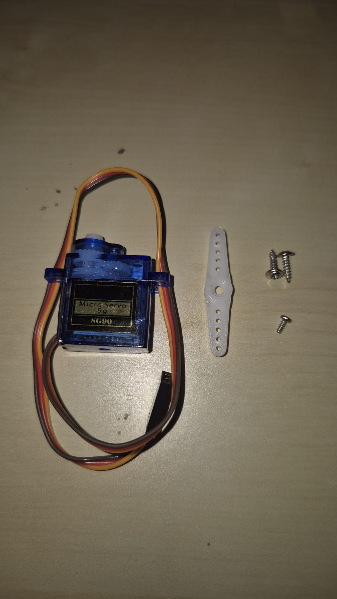
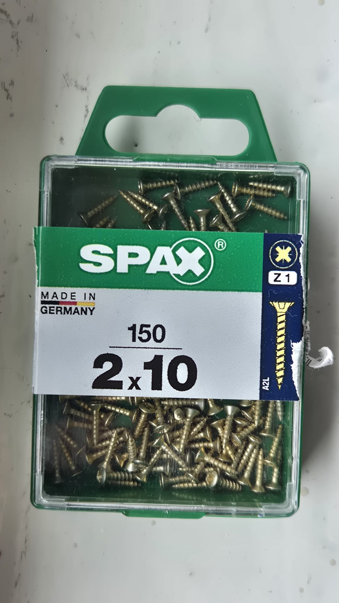
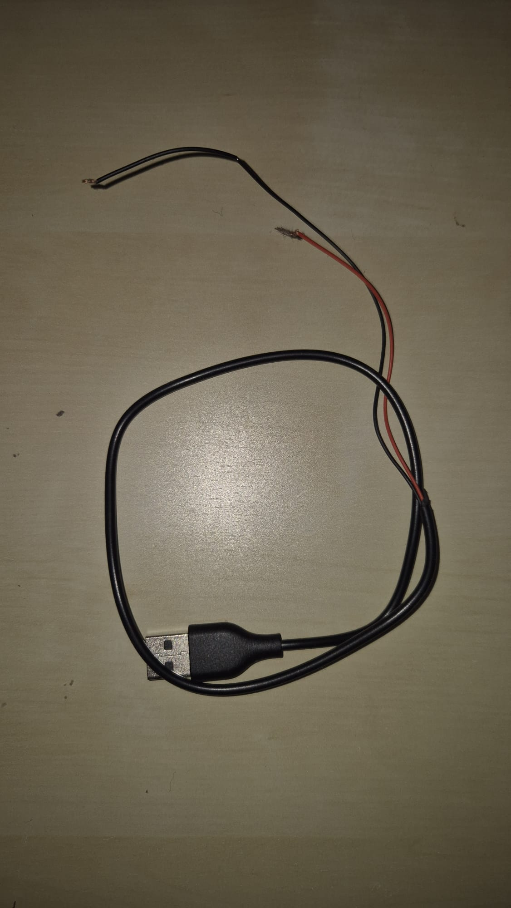
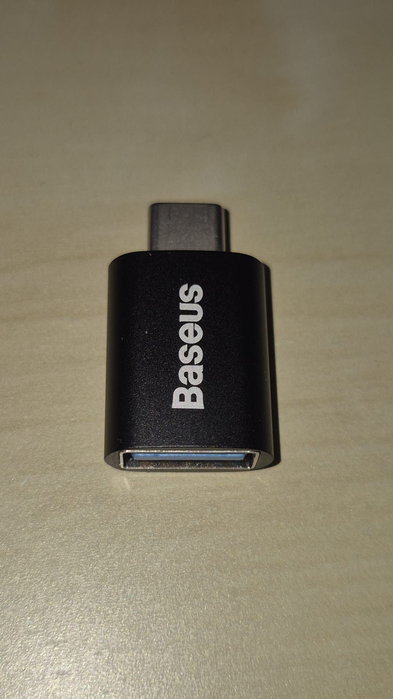
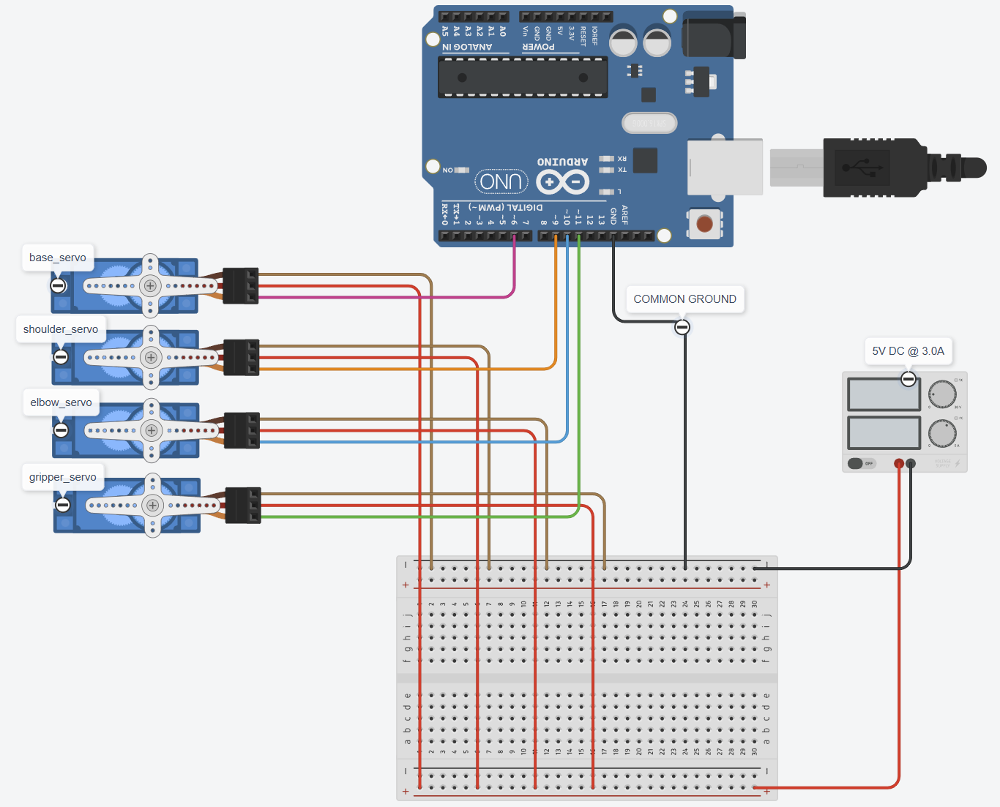

# Seven — 3-DOF Arduino Robotic Arm

> **⚠️ Safety Warning:** This project features a custom power supply setup. Please proceed at your own risk. I am not responsible for any damage to your components, your board, or yourself. Work carefully, and stay safe.

.jpg)

A 3-DOF (Degrees of Freedom) robotic arm built with 3D-printed parts and SG90 servo motors, controlled via an Arduino Uno over serial communication. Seven supports **manual joint control**, **inverse kinematics**, **gripper control**, **waypoint list programming**, and **external software integration** via a handshake protocol.

---

## Table of Contents

- [Features](#features)
- [Hardware Requirements](#hardware-requirements)
- [3D Printing](#3d-printing)
- [Wiring & Circuit](#wiring--circuit)
- [Testing](#testing)
- [Software Setup](#software-setup)
- [Command Reference](#command-reference)
- [Calibration](#calibration)
- [Coordinate System](#coordinate-system)
- [Waypoint Lists](#waypoint-lists)
- [External Software Integration (Handshake)](#external-software-integration-handshake)
- [Project Structure](#project-structure)

---

## Features

- **Manual Control** — Set individual joint angles directly
- **Inverse Kinematics** — Move the end effector to any (X, Y, Z) coordinate in 3D space
- **Directional Movement** — Move up/down/left/right/forward/backward by a set amount in cm
- **Gripper Control** — Open/close gripper, with calibration for custom open/close angles
- **Waypoint Programming** — Record up to 25 positions and replay them in a loop
- **Handshake Protocol** — Integrate with external software by synchronizing over serial
- **EEPROM Calibration** — Calibration offsets persist across power cycles
- **Adjustable Speed** — Control angular speed between 30–90 degrees/second

---

## Hardware Requirements


| Component | Details |
|---|---|
| Arduino Uno | Or equivalent board |
| SG90 Servo Motor | × 4 |
| Large Breadboard | For power distribution |
| Jumper Wires | Male-to-Male |
| 2mm × 10mm Screws | For frame assembly |
| USB-A Cable (stripped) | Custom power delivery |
| USB-A to USB-C Adapter | For power supply connection |
| USB Wall Adapter | 5V DC, 3.0A minimum (see below) |

### Photos

<table>
  <tr>
    <td align="center"><br/><sub>SG90 Servo + Screws</sub></td>
    <td align="center"><br/><sub>2mm × 10mm Frame Screws</sub></td>
    <td align="center"><br/><sub>Stripped USB-A Cable</sub></td>
    <td align="center"><br/><sub>USB-A to USB-C Adapter</sub></td>
    <td align="center"><br/><sub>Samsung 25W PD Adapter</sub></td>
  </tr>
</table>

### Power Supply Notes

- **Voltage:** 5V DC (Stable)
- **Current:** 3.0A minimum (2.5A if running fewer servos)
- **Power Rating:** 15W – 25W
- **Recommended:** Samsung 25W PD Adapter (EP-TA800) or equivalent high-quality branded charger

> ⚠️ **Do not use cheap, unbranded "knock-off" adapters.** Quality adapters include Short Circuit Protection (SCP) and Overcurrent Protection (OCP), which are vital when using a custom-stripped USB cable.

> 💡 **Voltage Stability:** Ensure the adapter defaults to 5V. While many "Fast Chargers" can output 9V or 12V, they will only do so if they detect a compatible device. A basic stripped USB cable will naturally pull the default 5V, which is safe for SG90 servos.

> 🔌 **Common Ground:** You **must** connect the negative (GND) wire from the adapter to the Arduino GND pin to ensure a common reference point for control signals.

---

## 3D Printing

All STL files are in the `STL_files/` folder. **Recommended filament: Hyper PLA.**

| File | Supports | Infill |
|---|---|---|
| `base_large.stl` | Tree (auto) · Tree Hybrid · Top Z: 0.25 | Default |
| `base_slim.stl` | Tree (auto) · Tree Hybrid · Top Z: 0.25 | Default |
| `base_rotation.stl` | Tree (auto) · Default · Top Z: 0.25 | Default |
| `lower_arm.stl` | None | Gyroid |
| `upper_arm.stl` | Tree (auto) · Tree Hybrid · Top Z: 0.25 | Gyroid |
| `gripper_upper_arm.stl` | Tree (auto) · Tree Hybrid · Top Z: 0.25 | Gyroid |
| `gripper.stl` | Tree (auto) · Tree Hybrid · Top Z: 0.25 | Gyroid |

---

## Wiring & Circuit



| Servo | Arduino PWM Pin |
|---|---|
| Base | Digital Pin 6 |
| Shoulder | Digital Pin 9 |
| Elbow | Digital Pin 10 |
| Gripper | Digital Pin 11 |

- Servo **power (5V & GND)** wires are routed through the breadboard, which is powered by the external USB adapter.
- The USB adapter's **negative (GND) wire** must be connected to an **Arduino GND pin** to establish a common ground.
- Servo **signal wires** connect directly to the corresponding Arduino digital pins.

---

## Testing

A dedicated test sketch is provided in `code/test/test.ino` to help with servo assembly and verification.

**How to use:**

1. Upload `code/test/test.ino` to the Arduino.
2. Open the Serial Monitor at **115200 baud rate**.
3. Send one of the following characters to select a servo to test:

| Input | Servo |
|---|---|
| `B` | Base (Pin 6) |
| `S` | Shoulder (Pin 9) |
| `E` | Elbow (Pin 10) |
| `G` | Gripper (Pin 11) |

4. After selecting a servo, enter a numeric angle value (within that servo's min/max range) to move it.
5. When powered, every servo automatically center it to 90°.

---

## Software Setup

1. Open `code/main/main.ino` in the Arduino IDE.
2. Upload the sketch to your Arduino Uno.
3. Open the **Serial Monitor** at **115200 baud rate**.
4. Send commands as described in the [Command Reference](#command-reference) below.

### Configuration (`config.h`)

Key constants that govern the arm's behavior:

| Constant | Value | Description |
|---|---|---|
| `REST_ANGLE` | 90° | Default resting angle for all joints |
| `DEFAULT_ANGULAR_SPEED` | 60°/s | Default movement speed |
| `MIN_ANGULAR_SPEED` | 30°/s | Minimum allowed speed |
| `MAX_ANGULAR_SPEED` | 90°/s | Maximum allowed speed |
| `DEFAULT_MOVE_AMOUNT` | 5 cm | Default step for directional moves |
| `MAX_VECTOR_ARR_SIZE` | 25 | Maximum number of waypoints |
| `LENGTH_SHOULDER_ELBOW` | 12 cm | Upper arm segment length |
| `LENGTH_ELBOW_GRIPPER` | 12 cm | Forearm segment length |

> These are tuned for the default arm geometry. Only modify them if you alter the physical build.

---

## Command Reference

All commands are case-insensitive. Send them via the Serial Monitor at 115200 baud.

### Calibration Commands

| Command | Description |
|---|---|
| `-C` | Calibrate and save current angles to EEPROM |
| `-R` | Reset all calibration and gripper angles to 0 and save |
| `-GO(ANGLE)` | Set and save the gripper **open** angle (e.g. `-GO(45)`) |
| `-GC(ANGLE)` | Set and save the gripper **close** angle (e.g. `-GC(0)`) |

### Movement Commands

| Command | Description |
|---|---|
| `S(SPEED)` | Set angular speed in degrees/second (e.g. `S(75)`) |
| `A(X Y Z)` | **Inverse Kinematics** — move end effector to (X, Y, Z) in cm |
| `M(BASE SHOULDER ELBOW)` | **Manual** — set angles for each joint directly |
| `G(ANGLE)` | Set current gripper angle |
| `GO` | Open gripper |
| `GC` | Close gripper |
| `O` | Reset arm to rest position (90°, 90°, 90°) |

### Directional Movement

Move the end effector in 3D space by a given distance in cm. Omitting the amount moves by the default 5 cm.

| Command | Description |
|---|---|
| `U(x)` / `U` | Move **up** x cm (default 5 cm) |
| `D(x)` / `D` | Move **down** x cm |
| `L(x)` / `L` | Move **left** x cm |
| `R(x)` / `R` | Move **right** x cm |
| `F(x)` / `F` | Move **forward** x cm |
| `B(x)` / `B` | Move **backward** x cm |

### Waypoint List Commands

| Command | Description |
|---|---|
| `+S` | Create a new list and save current position as the **start point** |
| `+W` | Save current position and gripper state as a **waypoint** |
| `+E` | Save current position as the **end point** and close the list |
| `+M` | **Begin looping** through the waypoint list |

### Handshake Commands

| Command | Description |
|---|---|
| `HA` | Activate handshake mode |
| `HD` | Deactivate handshake mode |

---

## Calibration

Due to physical mounting variation, servo joints may not align perfectly at their true 90° position. Calibration corrects this offset and stores it to EEPROM so it persists across power cycles.

**How to calibrate:**

1. Use the `M(BASE SHOULDER ELBOW)` command to manually adjust each joint until each one points exactly at its physical 90° rest position.
2. Once satisfied, send `-C` to save the calibration to EEPROM.

**Gripper calibration:**

1. Use `G(ANGLE)` to find a good open angle (typically ~45°) and close angle (typically ~0°).
2. Save them with `-GO(45)` and `-GC(0)`.

**Reset calibration:**

Send `-R` to wipe all calibration values (joints and gripper) back to zero.

---

## Coordinate System

The **shoulder servo's pivot point** is the origin `(0, 0, 0)`. All coordinates are in centimeters.

| Axis | Direction |
|---|---|
| X | Forward |
| Y | Left / Right |
| Z | Up / Down |

**Example:** `A(10 0 5)` moves the gripper to a point 10 cm forward and 5 cm up from the shoulder pivot.

**Reach limits:**
- Minimum X: 1 cm
- Minimum Z: −6 cm
- Maximum reach: ~24 cm (sum of both arm segments)

---

## Waypoint Lists

Waypoints let you record a sequence of positions and replay them continuously in a loop. The list can hold up to **25 waypoints**.

**Workflow (always in this order):**

```
+S  →  (move arm)  →  +W  →  (move arm)  →  +W  →  ...  →  +E  →  +M
```

1. Send `+S` to start a new list and record the current position as the start.
2. Move the arm to the next desired position, then send `+W` to record it as a waypoint.
3. Repeat step 2 for as many waypoints as needed (up to 25).
4. Send `+E` to record the final end position and close the list.
5. Send `+M` to start looping through the list.

> **Note:** All serial commands are blocked while the arm is executing a waypoint list. Waypoint commands (`+S`, `+W`, `+E`, `+M`) and calibration (`-C`) are disabled while handshake is active.

---

## External Software Integration (Handshake)

Seven can be controlled from any external application over serial.

- Send `HA` to activate handshake mode.
- In handshake mode, the Arduino prints `"K"` to the serial port after every update cycle.
- Your application should wait for `"K"` before sending the next command — this ensures commands are processed in sync with the arm's update loop.
- Send `HD` to deactivate handshake mode.

> While handshake is active, calibration (`-C`) and waypoint list commands (`+S`, `+W`, `+E`, `+M`) are disabled.

---

## Project Structure

```
seven_github/
├── code/
│   ├── main/
│   │   ├── main.ino            # Main Arduino sketch
│   │   ├── roboticArm.h/.cpp   # Core arm logic, IK, commands, EEPROM
│   │   ├── servoConfig.h/.cpp  # Servo wrapper with rotation direction & limits
│   │   ├── vector3.h/.cpp      # 3D vector math (magnitude, normalize, distance)
│   │   ├── fixedVector.h       # Fixed-size array for waypoint storage
│   │   └── config.h            # Global constants (speeds, angles, limits)
│   └── test/
│       ├── test.ino            # Servo testing sketch
│       ├── roboticArmTester.h  # Tester class header
│       ├── roboticArmTest.cpp  # Tester class implementation
│       ├── servoConfig.h/.cpp  # Servo config for test environment
│       └── config.h            # Constants for test environment
├── STL_files/
│   ├── base_large.stl
│   ├── base_slim.stl
│   ├── base_rotation.stl
│   ├── lower_arm.stl
│   ├── upper_arm.stl
│   ├── gripper_upper_arm.stl
│   └── gripper.stl
└── photos/
    ├── robotic_arm(seven).jpg
    ├── circuit.png
    ├── parts.png
    └── ...
```

---

*Author: Selçuk Yüksel*
